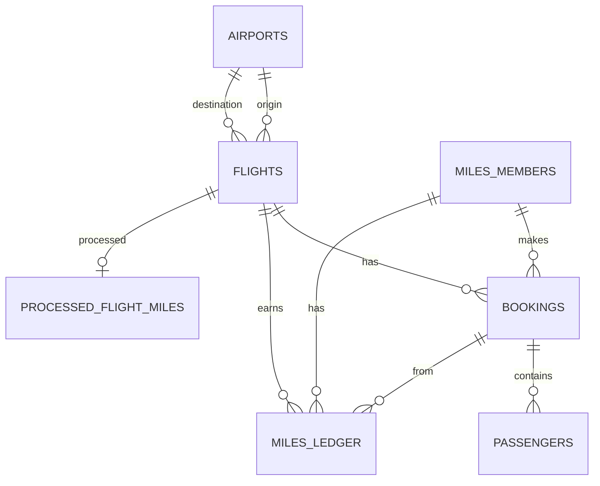

# Flight System (Airline Ticketing)

> **Repository:** https://github.com/cemilfahreci/Airline-Ticketing-System  
> **Author:** Cemil Fahreci  
> **Course:** SE4458 — Final Assignment

---

## 🚀 Final Deployed URLs

| Service | URL |
|---------|-----|
| **Customer UI** | https://airline-customer.vercel.app/ |
| **Admin UI** | https://airline-admin.vercel.app/ |
| **Backend API** | https://airline-gateway.onrender.com |

---

## 🎬 Demo Video

> **Link:** [https://www.youtube.com/watch?v=AwxxugNpdNs](https://www.youtube.com/watch?v=AwxxugNpdNs)

A short video demonstrating the project functionality, including Admin ML pricing, Customer booking flow, and Miles&Smiles integration.

---

## 🔐 Demo Credentials

| Panel | Email | Password |
|-------|-------|----------|
| Admin | admin@test.com | password123 |

---

---

## 🏗️ Design, Assumptions, and Issues

### Architecture & Design
The system follows a **microservices architecture** to ensure scalability and separation of concerns.
*   **Services:**
    *   `flight-service`: Handles flight management, bookings, and ML price prediction.
    *   `miles-service`: Manages loyalty points and nightly batch jobs.
    *   `notification-service`: Consumes RabbitMQ messages to send emails via SMTP.
*   **Gateway:** An API Gateway serves as the single entry point, routing requests to appropriate services.
*   **Infrastructure (Cloud Services):**
    *   **Database & Auth:** [Supabase](https://supabase.com) (Managed PostgreSQL + IAM)
    *   **Message Queue:** [CloudAMQP](https://www.cloudamqp.com) (Managed RabbitMQ)
    *   **Cache:** [Upstash](https://upstash.com) (Serverless Redis)
*   **ML Model:** A linear regression model is integrated into the Admin backend to predict flight prices based on duration and time-to-departure.

### Assumptions
1.  **Currency:** All prices are calculated and displayed in USD.
2.  **Points Calculation:** Passengers earn **1 mile point per km** of flight distance.
3.  **Nightly Jobs:** The system is designed to run batch jobs (like miles processing) at 02:00 AM local time.
4.  **Auth:** Authentication is managed entirely by Supabase Auth; local user tables are linked via UUID.

### Issues Encountered
*   **ML Accuracy:** The linear regression model is basic and may not reflect real-world dynamic pricing complexities.
*   **Deployment:** Configuring CORS properly between Vercel (Frontend) and Render (Backend) required fine-tuning.
*   **Round-Trip Logic:** The current booking flow is optimized for one-way tickets; round-trip is supported as two separate bookings in the backend.

---

## 🗂️ Data Models (ER Diagram)

The system uses a relational database schema. Below is the simplified Entity-Relationship diagram:

*   `flights`: Stores schedule, capacity, and base price.

*   `bookings`: Links users to flights.
*   `passengers`: Stores individual passenger info per booking.
*   `miles_members`: Stores loyalty program profiles and tier status.
*   `miles_ledger`: Tracks point history (earnings/spendings).
